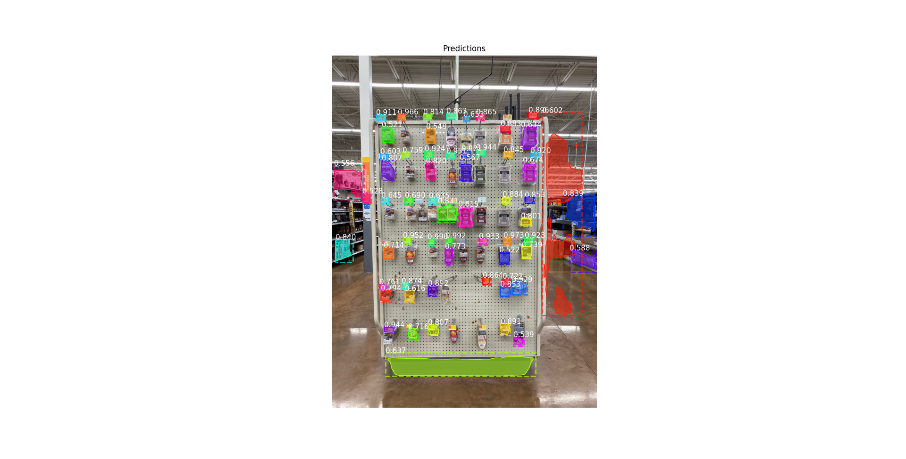

# MaskRCNN 2
Training and Inference script for MaskRCNN multi-class model.

# Requirements
- Python 3.6
- Virtualenv
# Installation

`git clone `

`virtual-env --python=3.6 env`

`source env/bin/activate`

`pip install -r requirements.txt`

download weights from 
`https://drive.google.com/file/d/1hP7ZHbXYpB3lzSb3m9Dh2Tc_3wBAz-7s/view?usp=sharing`
# Additional installation
- Edit `env/lib/python3.6/site-packages/keras/engine/topology.py, line 3114` 
	- from
	```
	if  'keras_version'  in f.attrs:
		original_keras_version = f.attrs['keras_version'].decode('utf8')
	else:
		original_keras_version =  '1'
	if  'backend'  in f.attrs:
		original_backend = f.attrs['backend'].decode('utf8')
	else:
		original_backend =  None
	```
	- to
	```
	if  'keras_version'  in f.attrs:
		original_keras_version = f.attrs['keras_version']
	else:
		original_keras_version =  '1'
	if  'backend'  in f.attrs:
		original_backend = f.attrs['backend']
	else:
		original_backend =  None
	```
# Run inference
`python inference.py splash --image IMG_1200.jpeg --weights mask_rcnn_custom_0150.h5`


